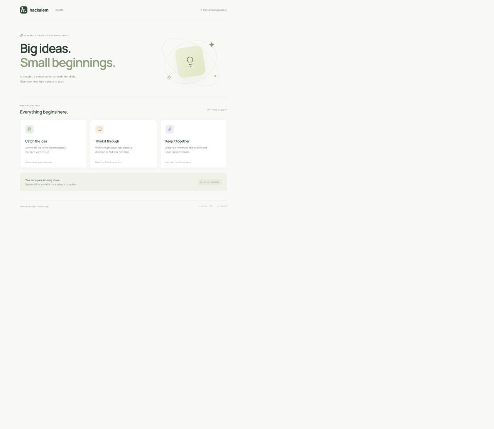

# Hackalem · nullptr

A fullstack hackathon starter built with TanStack Start, React, TanStack AI, Clerk, and Cloudflare Workers. Target domain: **https://hackalem.abzal.dev**.



## Start locally

Install [Bun](https://bun.sh/) 1.4 or later, then:

```sh
bun install --frozen-lockfile
cp .env.example .env
cp .dev.vars.example .dev.vars
bun run db:migrate
bun run dev
```

Open **http://localhost:3000**. The public landing page works without credentials. Private APIs return `503` until Clerk is configured; they never fall back to an anonymous or shared user.

Add your Clerk development publishable key to `.env`, and the matching secret key and an OpenAI API key to `.dev.vars`. Restart the dev server after changing keys.

| Variable                     | Where                       | Purpose                                                  |
| ---------------------------- | --------------------------- | -------------------------------------------------------- |
| `VITE_CLERK_PUBLISHABLE_KEY` | `.env` / build environment  | Public Clerk key, embedded by Vite                       |
| `CLERK_SECRET_KEY`           | `.dev.vars` / Worker secret | Server-only Clerk key                                    |
| `OPENAI_API_KEY`             | `.dev.vars` / Worker secret | Server-only chat and embeddings key                      |
| `APP_URL`                    | `wrangler.jsonc`            | Allowed Clerk token origin                               |
| `VECTOR_SEARCH_ENABLED`      | `wrangler.jsonc`            | Enables semantic search when a binding and API key exist |

Use matching keys from the same [Clerk application](https://dashboard.clerk.com/). Sign-in and sign-up use Clerk’s modal flow. Authenticated users receive their own notes, drafts, and files. No webhook or local user synchronization is required.

Bun runs the package manager, Vite, Wrangler, Drizzle, scripts, and tests. Application server code runs inside **workerd** locally and the **Workers runtime** in production. `bunfig.toml` loads a small compatibility fix for [Bun’s incomplete Undici dispatcher](https://github.com/oven-sh/bun/issues/39247); it uses the installed npm implementation and never enters the Worker bundle.

## Included examples

| Feature                  | Implementation                                                                                         |
| ------------------------ | ------------------------------------------------------------------------------------------------------ |
| SSR and server functions | TanStack Start; the root route loads public configuration through a server function                    |
| Authentication           | Clerk middleware, provider, modal sign-in, user menu; every private endpoint checks the server session |
| Streaming AI chat        | `useChat` + `fetchServerSentEvents`, authenticated `/api/chat`, server-side OpenAI adapter             |
| D1 + Drizzle             | Private notes, generated SQL migrations, typed queries, ownership filtering                            |
| Workers KV               | Explicitly saved note drafts, seven-day expiry, per-user keys                                          |
| R2                       | Private upload/list/download/delete, per-user keys, 5 MiB upload limit, attachment-only downloads      |
| Vectorize                | Explicit note indexing, semantic search, per-user namespaces, D1 ownership recheck                     |

Chat follows the [TanStack AI quick start](https://tanstack.com/ai/latest/docs/getting-started/quick-start.md), using `chatParamsFromRequestBody` after bounded JSON validation. The default model is `gpt-4.1-mini`; change it in `src/routes/api.chat.ts`. This starter supports text messages and a page-session chat history. System instructions and tools are defined on the server, not accepted from callers.

KV is eventually consistent: the draft feature is not a lock, session store, or rate limiter. The examples display up to 100 notes and files. Add pagination and application-specific limits as the hackathon product develops.

## Database migrations

Edit `src/db/schema.ts`, generate a migration, review the SQL, and apply it:

```sh
bun run db:generate --name add_feature
bun run db:migrate
```

Commit both `drizzle/*.sql` and `drizzle/meta/`. Drizzle generates migrations; Wrangler applies and tracks them in D1. Do not use `drizzle-kit push` against an environment managed by these migrations.

```sh
# Explicitly applies the same migrations to the production database
bun run db:migrate:production
```

Local D1, KV, and R2 persist under ignored `.wrangler/` state. Tests use separate disposable storage.

## Vectorize in development

Vectorize has no local emulator. Normal development works without a Cloudflare account and leaves semantic search disabled. To opt into remote development:

```sh
bun run cf login
bun run cf vectorize create hackalem-vectors-dev --dimensions 1536 --metric cosine
```

Add this binding at the top level of `wrangler.jsonc`, change the top-level `VECTOR_SEARCH_ENABLED` to `"true"`, and run `bun run cf:typegen`:

```json
"vectorize": [
  { "binding": "VECTORIZE", "index_name": "hackalem-vectors-dev", "remote": true }
]
```

Use a separate development index. Embeddings call OpenAI and the index is a real Cloudflare resource. The helper uses `text-embedding-3-small`, **1536 dimensions**, and cosine similarity. A different dimension requires a new matching index. Click **Add to search** on an existing note to index it; indexing is explicit so a provider failure never prevents saving the note. Vector mutations are asynchronous and can take time to become searchable.

## Deploy to Cloudflare Workers

The repository contains deployment configuration; it has **not provisioned resources or deployed a Worker**. `env.production` targets `hackalem.abzal.dev`; local storage is configured separately. The domain must belong to an active Cloudflare zone in your account.

1. Authenticate and create the production resources:

   ```sh
   bun run cf login
   bun run cf whoami
   bun run cf kv namespace create hackalem-kv
   bun run cf d1 create hackalem-db
   bun run cf r2 bucket create hackalem-files
   bun run cf vectorize create hackalem-vectors --dimensions 1536 --metric cosine
   ```

2. Copy the returned KV and D1 IDs into **`env.production`** in `wrangler.jsonc`, replacing the two `REPLACE_WITH_...` values. Set an `account_id` there if you need to select a specific account. Keep the bucket and index names aligned with those created above.

3. Configure a **production Clerk instance** for `hackalem.abzal.dev` and complete Clerk’s domain/DNS setup. Put its public `pk_live_...` key in an ignored `.env.production` file (or `VITE_CLERK_PUBLISHABLE_KEY` in CI). Vite embeds this key at build time; setting it only as a Worker variable is insufficient.

4. Set Worker secrets through the interactive prompts:

   ```sh
   bun run cf secret put CLERK_SECRET_KEY --env production
   bun run cf secret put OPENAI_API_KEY --env production
   bun run cf:typegen
   ```

5. Verify and deploy:

   ```sh
   bun run check
   bun run deploy:dry-run
   bun run deploy
   ```

`deploy` validates the production IDs, live public key, and required secret names, builds with `CLOUDFLARE_ENV=production`, applies remote D1 migrations, then deploys. `deploy:dry-run` builds and packages without applying migrations, creating resources, or publishing; it also works while resource IDs remain placeholders. Cloudflare’s custom-domain route manages the Worker’s DNS/TLS once deployment succeeds.

For Cloudflare Workers Builds, set the build command to `bun install --frozen-lockfile && bun run check`, the deploy command to `bun run deploy`, and provide the production publishable key in the build environment. The build identity needs access to the configured storage resources and Worker secrets. Production secrets remain Wrangler-managed; never prefix a secret with `VITE_`.

## Commands and checks

```sh
bun run check              # Generated binding types, build, TypeScript, tests, formatting
bun run test               # HTTP, real local storage, ownership, and AI transport tests
bun run test:smoke         # Against an already running localhost:3000
bun run build
bun run preview            # Serve the most recent build in workerd
bun run deploy:dry-run     # Package the production Worker without publishing
bun run format
```

For a different smoke-test URL, run `SMOKE_URL=http://localhost:4173 bun run test:smoke`. Smoke tests require anonymous requests to be denied. Storage tests inject synthetic identities and use real local D1/KV/R2; they do not verify Clerk’s remote session exchange. Live Clerk sign-in, OpenAI responses, and Vectorize queries require credentials and provisioned services.

Wrangler’s optional startup profiler currently fails under Bun with a JavaScript MIME-type error. Profiling can be run separately with `node node_modules/wrangler/bin/wrangler.js check startup --env production --outfile .wrangler/startup.cpuprofile` after a production build. This tooling limitation does not affect the verified Bun dev/build/test/deployment dry-run commands.

## Project map

```text
src/
  components/          Chat, notes, and files panels
  db/                  Drizzle schema and request-scoped D1 client
  lib/                 Auth, API boundaries, storage, search, and validation
  routes/              Pages and HTTP endpoints
  start.ts             Clerk request middleware
  router.tsx           Router factory
drizzle/               Committed SQL migrations and snapshots
scripts/               Bun compatibility, deployment checks, HTTP smoke checks
tests/                 Offline transport, security boundary, and storage tests
wrangler.jsonc         Local and production Worker configuration
worker-configuration.d.ts  Generated Cloudflare runtime and binding types
```

Keep binding and secret access in server-only modules. Pass the authenticated `userId` to every storage operation; do not accept it from request bodies. Generate types after changing bindings. The initial schema uses Clerk IDs directly, so account deletion/data retention can be added when the product requirements are known.

API routes: `/api/health`, `/api/chat`, `/api/notes`, `/api/notes/:id`, `/api/notes/:id/embed`, `/api/draft`, `/api/files`, `/api/files/:id`, and `/api/search`. Everything except health requires a Clerk session.

References: [TanStack Start on Workers](https://developers.cloudflare.com/workers/framework-guides/web-apps/tanstack-start/), [Clerk TanStack Start](https://clerk.com/docs/tanstack-react-start/getting-started/quickstart), [Drizzle + D1](https://orm.drizzle.team/docs/connect-cloudflare-d1), [Vectorize](https://developers.cloudflare.com/vectorize/get-started/intro/).
